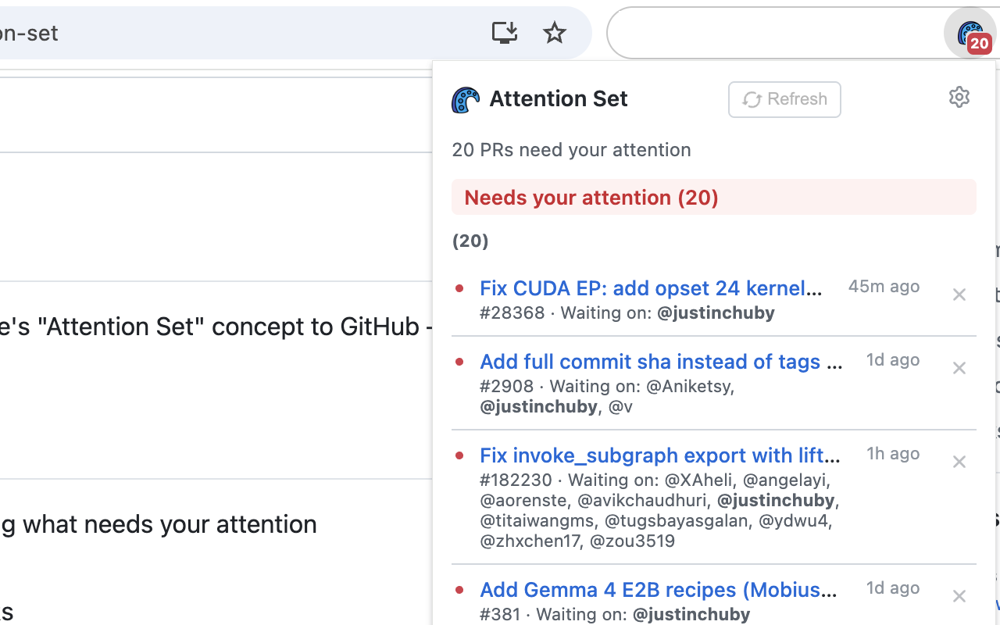

# GitHub Attention Set

> Know whose turn it is on every PR — inspired by Google's Critique



## What is Attention Set?

Code review is turn-based. At any point, someone is blocking progress — either the author needs to address feedback, or a reviewer needs to respond. **Attention Set tells you whose turn it is.**

Google's internal code review tool (Critique) has had this concept for years. GitHub doesn't. This extension brings it to GitHub.

## How It Works

The extension monitors PR activity and computes who currently needs to act:

| Event | Who enters the attention set |
|---|---|
| Reviewer submits a review | Author |
| Someone leaves a comment (debounced, default 10 min) | Author |
| Author re-requests review | Reviewer |
| Author replies to a comment (debounced) | Reviewer |
| @mention someone | That person |

**Leaving the attention set:** You leave automatically once you take action (reply, review, push, etc.).

**Filtering:** Bot accounts and org/team mentions are automatically excluded.

## Features

- 🔴 Badge shows count of PRs needing your attention
- Popup grouped by status: **Needs your attention** / **Waiting on others**
- Optional group by repo
- Dismiss PRs (auto-restores on new activity)
- Relative timestamps
- Repo filter (show only / hide specific repos)
- Dark mode support
- 30+ languages (including Cantonese, Classical Chinese, Traditional Mongolian, and 🏴‍☠️ Pirate)
- All data stays local — nothing synced to Google servers

## Install

**Chrome Web Store:** [Install GitHub Attention Set](https://chrome.google.com/webstore/detail/gkimnedgjndjblnobajlecmndgjhkjfl)

**Manual (development):**

```bash
git clone https://github.com/justinchuby/github-attention-set.git
cd github-attention-set
npm install
```

Then load as unpacked extension in `chrome://extensions` (enable Developer mode).

## Setup

1. Create a fine-grained Personal Access Token at [github.com/settings/personal-access-tokens/new](https://github.com/settings/personal-access-tokens/new)
2. Grant permissions:
   - **Pull requests** → Read
   - **Issues** → Read
3. Open the extension options and paste your token

## Privacy

- Token stored in `chrome.storage.local` only (never synced to Google)
- All GitHub API calls made over HTTPS
- No data sent to any third party
- No analytics or tracking of any kind

## Development

```bash
npm install
npm test
```

Load the extension as unpacked in `chrome://extensions` with Developer mode enabled.

## References

- [Google's Critique: Chapter 19 — Software Engineering at Google](https://abseil.io/resources/swe-book/html/ch19.html#:~:text=The%20attention%20set%20comprises%20the%20set%20of%20people%20on%20which%20a%20change%20is%20currently%20blocked.) — Original concept of the Attention Set
- [Gerrit Code Review — Attention Set](https://gerrit-review.googlesource.com/Documentation/user-attention-set.html) — Open-source implementation in Gerrit

## License

MIT
